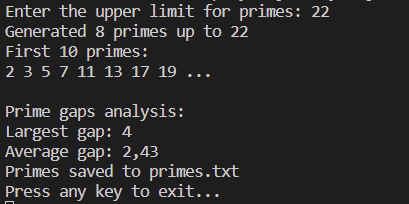
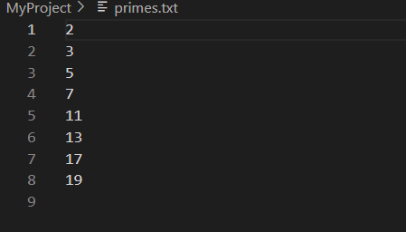

# Prime Number Explorer

This C# console application generates prime numbers up to a user-specified limit, 
analyzes their distribution (largest and average gap), displays the first 10 primes, 
and saves all primes to a file.

## Features

- Demonstrates arrays, strings, loops, conditionals, OOP, and file handling.
- Computes mathematical properties of primes (gaps analysis).
- Saves primes to `primes.txt`.

## How to Run

1. Clone the repository.
2. Open in Visual Studio or VS Code.
3. Build using `dotnet build`.
4. Run using `dotnet run`.
5. Enter an upper limit for primes.
6. Check console output and `primes.txt`.

## Screenshots

Program running in console:

Generated primes file:

## Release

The release build can be found in the `Release/` folder.
